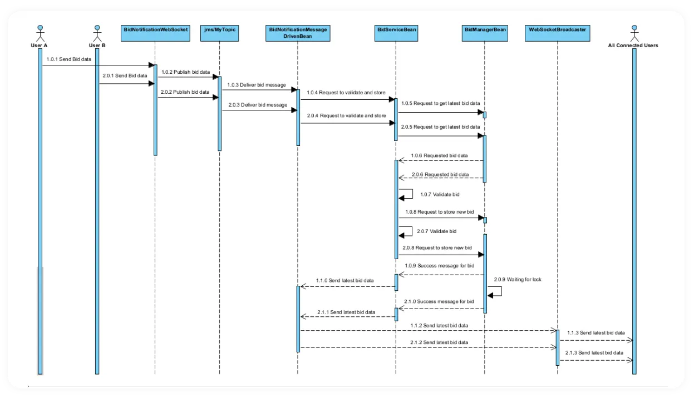

<h1 align="center">Online Auction System</h1>

A Modular Java EE-Based Solution for Real-Time Bidding with Container-Managed Concurrency and Asynchronous Messaging

 

## Introduction

In the context of rapidly evolving digital commerce, the need for responsive, scalable, and modular online auction systems has become increasingly critical. This project explores the design and implementation of a distributed online auction system developed using Enterprise JavaBeans (EJB), Contexts and Dependency Injection (CDI), Java Message Service (JMS), and WebSocket technologies.The application aims to provide a robust and research-grounded solution to the challenges of real-time bidding systems. The proposed system allows users to register, authenticate, join auctions, and place bids in a live environment, where consistent state synchronization and fault-tolerant communication are of utmost importance. The software leverages EAR-based modular deployment to facilitate separation of concerns, scalability, and concurrent processing using container-managed services.

## Problem Domain

Modern auction platforms are tasked with supporting high levels of concurrent user interaction, real-time responsiveness, and data integrity. These requirements are compounded when systems must scale across distributed networks and support real-time synchronization. Existing solutions often lack the architectural modularity required for scalable development, or fail to incorporate asynchronous messaging for concurrent event handling. Traditional systems tend to perform poorly under concurrent access or when broadcasting real-time updates, leading to race conditions, delayed bid propagation, and inconsistent auction states across user interfaces.

This project seeks to address these shortcomings by constructing an online auction system that is designed to handle real-time events across geographically distributed clients. The system not only allows for live bid updates but ensures that concurrent users can interact without corrupting the auction’s state. Special emphasis has been placed on designing a system that promotes modularity and maintainability, aligning with enterprise-grade development standards.

## Research Gap and Objectives

Although numerous auction platforms exist, few employ the complete suite of Java EE technologies to their full extent, particularly in a research context. Many systems overlook advanced patterns such as container-managed concurrency and JMS-based asynchronous communication. The research gap addressed here involves developing a real-time, distributed auction system that not only demonstrates these technologies but also evaluates their effectiveness in ensuring consistency and scalability under concurrent load.

The system’s objectives are to demonstrate the utility of EJB’s component model for business logic separation, utilize JMS and WebSocket integration for real-time communication, and validate the architecture through performance and concurrency testing. These components are designed to offer a comprehensive example of how Java EE technologies can address complex business requirements in distributed systems.

## System Architecture

The architecture of the application follows a layered enterprise model and is packaged as a modular EAR (Enterprise Archive) application. The overall system comprises four logically separated Maven modules: `auction-core`, `auction-ejb`, `auction-web`, and `auction-ear`. This separation promotes clean modularization, reusability, and maintainability.

The `auction-core` module contains all domain entities, shared data transfer objects (DTOs), utility classes, and constant definitions. It acts as a foundational library used by both the EJB and web layers, enabling consistent data modeling across the entire system.

The `auction-ejb` module encapsulates the business logic layer of the application. It implements all core functionalities such as user registration and authentication, auction lifecycle management, bid validation, and concurrency control. The module includes a combination of singleton session beans (e.g., AuctionManagerBean, BidManagerBean) for managing application-wide state, stateful session beans (e.g., UserSessionManagerBean) for tracking user-specific sessions, and stateless session beans for discrete, reusable business operations.

The `auction-web` module serves as the presentation and control layer. It includes JSP pages for user interaction, servlet controllers that coordinate between the frontend and backend services, and WebSocket endpoints to enable real-time communication during live auctions. Bid updates are broadcast to all participants via WebSocket, with messages delivered asynchronously through a JMS topic managed by OpenMQ, the default message broker embedded in Payara Server.

Finally, the `auction-ear` module serves as the top-level aggregator, bundling all other modules into a single deployable unit. This structure facilitates smooth deployment on any compliant Java EE server while preserving the modularity of the system's internal architecture.

A component diagram has been included to illustrate the interaction between various enterprise beans across the system. Furthermore, a concurrency sequence diagram demonstrates the behavior of the application under simultaneous bidding scenarios, highlighting the use of container-managed locking mechanisms such as `@Lock(LockType.WRITE)` to ensure safe concurrent access to shared resources.

  

  

## Key Features and Technologies

The application includes core functionalities such as user registration, login authentication, real-time auction participation, and bid broadcasting. Real-time updates are facilitated through WebSocket communication, with each auction room associated with its own WebSocket session group. Bid messages are transmitted through JMS topics, consumed by Message-Driven Beans (MDBs), and broadcast to all clients using asynchronous WebSocket messages.

  
  
  
  
  
  

The technology stack includes Java EE (Jakarta EE) with Payara Server 6.26.0, employing EJB for business logic, JMS (via OpenMQ) for messaging, and standard Java Web APIs for the user interface. All application data is stored in-memory to simulate session and application scope handling, intentionally avoiding external databases to highlight container-managed memory management and state retention.

## Performance Testing

To evaluate the system’s ability to handle concurrent access and maintain real-time responsiveness, extensive testing was conducted using Apache JMeter. The tests simulated multiple users logging in and interacting with the auction room simultaneously. One critical scenario involved simulating 10 concurrent user logins and bid placements, testing the system’s ability to maintain consistent state and broadcast bid updates under load. The average bid processing time remained under 250 milliseconds, and WebSocket synchronization across clients was consistently accurate.

JMeter was configured with thread groups representing concurrent users, and POST requests were issued to the login servlet and auction bid endpoints. Additionally, test plans simulated real-time bidding surges to validate the system’s locking mechanisms and state integrity.

Screenshots of the JMeter test configurations and results, as well as observed performance metrics, are provided in the repository.

  
  
  
  
  
  
  

## Installation and Deployment

To install and deploy the system, the project repository should be cloned and opened in a Java EE-compatible integrated development environment (IDE) such as `IntelliJ IDEA` or `Eclipse`. The application is structured as a multi-module Maven project and packaged using an Enterprise Archive (EAR) format for deployment. After building the project with Maven, the generated EAR file can be deployed to Payara Server version 6.26.0, which fully supports EAR deployment and integrated OpenMQ messaging. Deployment can be performed via the Payara admin console or using automated deployment tools provided by the IDE.

Once deployed, the application is accessible through the URL `http://localhost:8080/auction-web`. Users can register, log in, join active auction rooms, and participate in real-time bidding sessions. The application operates entirely in memory without external databases, making it lightweight and suitable for testing.

For performance testing, Apache JMeter was used to simulate concurrent user interactions. Scenarios such as simultaneous logins and real-time bid submissions were tested using predefined user accounts (e.g., test1, test2, ..., test5). These tests helped verify the system’s behavior under load, ensuring consistent session management, proper broadcast synchronization, and overall stability in a concurrent environment.

## Defect Tracking and Fixes

During development, several notable defects were identified and resolved. One significant issue involved the injection of remote interfaces (`@Remote`) into beans, which led to inconsistent state due to serialization. This was resolved by switching to local interfaces (`@Local`), ensuring object references remained within the same JVM.

Another major defect pertained to the incorrect session scoping of the `UserSessionManagerBean`. Initially injected using `@EJB`, the bean was shared across sessions. The issue was resolved by manually creating and storing the stateful session bean within the `HttpSession` scope, thereby preserving per-user isolation.

Additional fixes included correcting WebSocket connection paths, fixing JMS resource lookups for message-driven beans, and synchronizing bid storage and broadcast processes.

## Conclusion

This project presents a robust, research-informed implementation of a distributed online auction platform using modern Java EE technologies. The system demonstrates effective use of modular architecture, container-managed concurrency, and asynchronous communication. The testing and validation processes confirm its scalability and reliability in concurrent user environments. This application serves as a strong academic reference for students and researchers interested in enterprise Java development, real-time systems, and distributed architecture design.

## License

This project is licensed under the MIT License. See the [LICENSE](LICENSE) file for more details.
